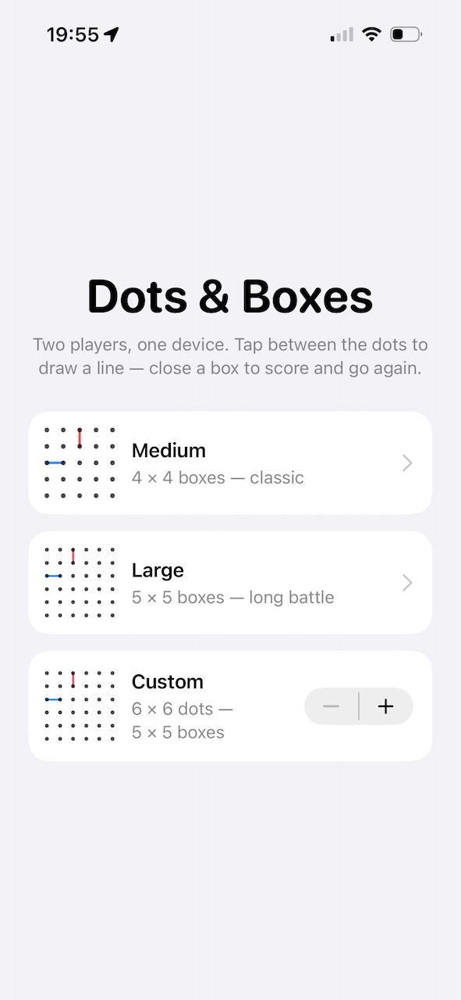
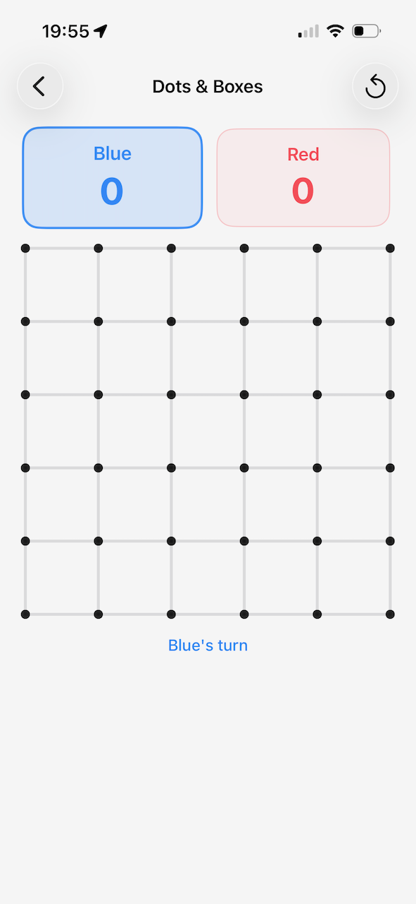
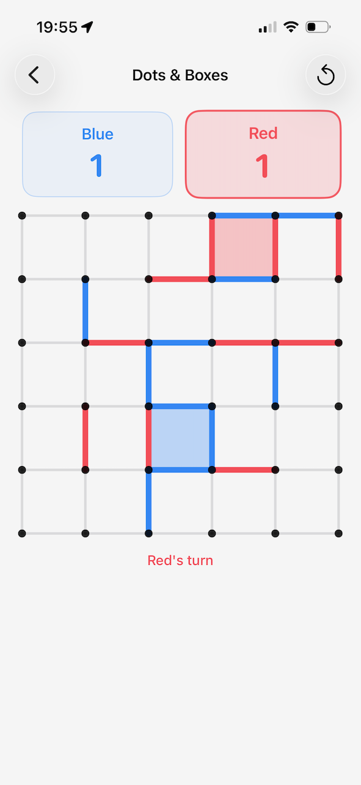

# Dots & Boxes

A two-player Dots and Boxes game for iPhone and iPad, written in SwiftUI. One
device, two players — pass it back and forth, tap between the dots to draw a
line, and try to claim more boxes than your opponent.

## About

Dots and Boxes is a classic pencil-and-paper game. Players take turns drawing
one line between two neighboring dots. Completing the fourth side of a box
claims it and earns another turn. When every space between dots is filled, the
player who claimed the most boxes wins.

This version includes:

- **Two players, one device** — Blue vs Red, pass-and-play
- **Tap to connect** — tap between two dots to draw a line; no dragging
- **Three grid options** — Medium (5×5 dots), Large (6×6), and a Custom size
  from 6 to 20 dots per side
- **Auto-save** — leaving the screen or quitting the app never loses a game;
  the start screen shows a "Resume" badge with the current score
- **Undo** — take back moves one at a time, even after restarting the app
- **Sound feedback** — a synthesized pop for each line, a chime when you claim
  a box, and a short fanfare when the game ends (no audio files needed)
- **Last-move highlight** — the newest line blinks, so it's always clear what
  just happened
- **iPhone and iPad** — adaptive layout with rotation and multitasking support
- **Dark and light mode** — follows the system appearance

## Screenshots

<p align="center">
  
  &nbsp;&nbsp;
  
  &nbsp;&nbsp;
  
</p>

## Requirements

- Xcode 16 or later
- iOS 16 or later — runs on both iPhone and iPad

## Getting started

1. Clone this repository.
2. Open `DotsAndBoxes.xcodeproj` in Xcode.
3. Select an iPhone or iPad simulator and press **⌘R** to run.

To run on a physical device, open the project settings, set your **Team** under
*Signing & Capabilities*, and change the bundle identifier
(`com.example.DotsAndBoxes`) to something unique.

## Project structure

```
DotsAndBoxes/
├── DotsAndBoxesApp.swift   App entry point
├── MenuView.swift          Grid-size picker
├── GameView.swift          Scoreboard, turn indicator, game-over panel
├── BoardView.swift         Board rendering, tap handling, last-line blink
├── Game.swift              Game rules, undo history, and save/load persistence
└── PopSound.swift          Synthesized sound effects (pop, chime, fanfare)
```

The game logic lives in `Game.swift` and is deliberately kept separate from
the views, so the rules are easy to read and modify.

## License

MIT — do whatever you like, attribution appreciated.
